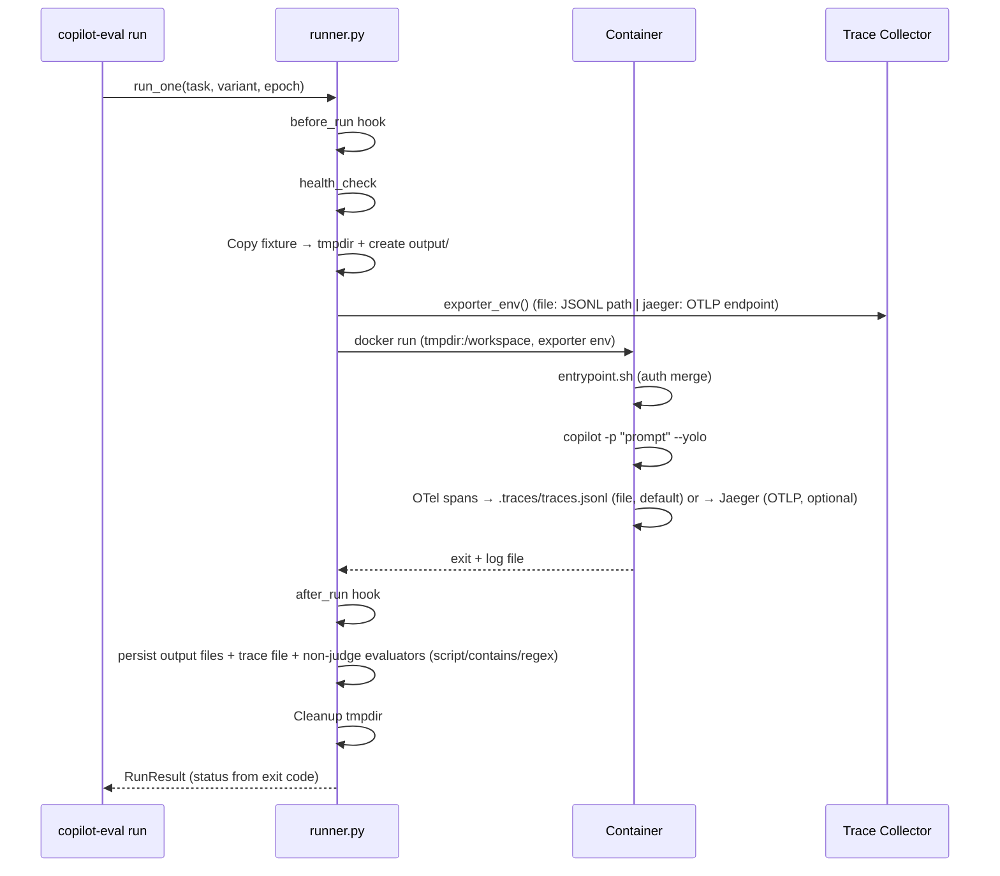
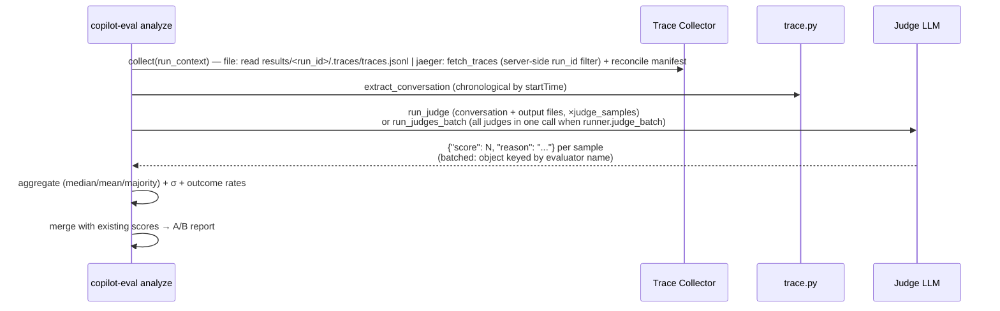

# Architecture

## Overview

```
eval-config.yaml
       ↓
  copilot-eval build     → Docker images per variant
  copilot-eval run       → Containers → OTel → Trace Collector (file by default, jaeger optional)
  copilot-eval analyze   → Traces → A/B report
```

## Components

```
eval/
├── __init__.py   Package marker
├── __main__.py   `python -m eval` entry
├── cli.py        Click CLI: list, build, run, analyze
├── config.py     YAML config → dataclasses (Config, Task, Variant, Evaluator, Hooks)
├── runner.py     Single eval run: hooks → Docker container → evaluators
├── protocols.py  AgentRunner / TraceCollector protocol interfaces (dual abstraction)
├── collectors/   TraceCollector implementations: file_collector.py (default), jaeger_collector.py
├── trace.py      Jaeger API: fetch + parse OTel traces
└── report.py     A/B comparison: build_report() → format_table/json/markdown

docker/
├── Dockerfile     Base image: Node 20 + Copilot CLI (version pinned)
└── entrypoint.sh  Auth merge + setup script execution
```

## Execution Flow



`run_one` records the container exit code and maps it to a status:
`0` → `completed`, `124` (GNU `timeout`) → `timeout`, any other non-zero → `failed`
(health-check failures are `setup_failed`). `RunResult.passed` requires
`status == "completed"`, so timed-out or errored runs are never counted as passing.
After all runs finish, `run` writes a **`results.json` manifest** into the run
directory recording every run (task/variant/epoch, test_id, exit_code, status,
scores) plus the execution schedule: a top-level `schedule` block (parallel mode,
max_workers, variant_order, seed) and per-run timing (order_index, started_at,
finished_at, duration_seconds) so order/concurrency confounders can be analyzed
post-hoc. `analyze` reconciles against this manifest so failed/timeout/missing
runs are reported rather than silently dropped.

Judge (LLM-as-Judge) evaluators do **not** run during `run`. They run later in
`copilot-eval analyze`, which fetches traces, reconstructs the conversation, and
scores it. `metric` evaluators are also evaluated at `analyze` time — deterministically,
straight from the parsed `RunMetrics` (no LLM) — and their pass/fail scores are merged
into the same `.scores.json` files:




## Docker Design

### Base Image

`docker/Dockerfile` provides a minimal base:
- `node:20-slim` + Copilot CLI (version pinned via `COPILOT_VERSION`)
- `entrypoint.sh` handles auth merging

### Variant Images

Each variant extends the base with its own Dockerfile:

```dockerfile
FROM copilot-eval:base
# Install tools, plugins, etc.
RUN copilot plugin install microsoft/azure-skills
```

### COPILOT_HOME

COPILOT_HOME **must be writable** inside the container. The entrypoint merges host auth (`logged_in_users`, `last_logged_in_user`, `staff`) into a writable copy, preserving image-side config like `installed_plugins`.

### Workspace

Fixtures are copied to a host tmpdir and mounted as `/workspace` (read-write). An `output/` subdirectory is created automatically for Copilot to write artifacts. The tmpdir is cleaned up in a `finally` block after evaluators run.

## Trace Collection

The framework separates **execution** from **trace collection** via two protocols
defined in `eval/protocols.py`:

- **`AgentRunner`** — builds variant images and executes the Copilot container
  (implemented by `runner.py`).
- **`TraceCollector`** — tells the container how to export OTel spans
  (`exporter_env()`) and reads the resulting spans back (`collect()`), implemented
  by `eval/collectors/file_collector.py` and `eval/collectors/jaeger_collector.py`.

`runner.collector` (in `eval-config.yaml`) selects the implementation via
`eval/collectors/create_collector()`. Because the two protocols are decoupled,
trace storage can change without touching container execution logic, and vice versa.

### File collector (default)

`collector: file` requires **no external infrastructure**:

1. The runner sets `COPILOT_OTEL_EXPORTER_TYPE=file` and
   `COPILOT_OTEL_FILE_EXPORTER_PATH=/workspace/.traces/traces.jsonl` as container env vars.
2. Copilot CLI appends one JSON span per line to that file as the session runs.
3. After the container exits, `runner.py` copies the file from the mounted tmpdir
   (`/workspace/.traces/traces.jsonl`) to `results/<run_id>/.traces/traces.jsonl`,
   before the tmpdir is cleaned up.
4. `copilot-eval analyze` reads `results/<run_id>/.traces/traces.jsonl` directly
   (`file_collector.py: parse_file_traces`) — no network calls, no ingestion delay.

### Jaeger collector (optional)

`collector: jaeger` remains supported for **backward compatibility** and for
**advanced debugging/visualization** — the Jaeger UI lets you browse spans
interactively, which the file collector doesn't provide. It requires a running
Jaeger instance (`docker-compose.yml`); spans are exported over OTLP to
`otel_endpoint`, and `analyze` fetches them back from Jaeger's HTTP API
(`jaeger_url`), retrying while ingestion catches up.

## OTel Tracing

Copilot CLI emits spans for each agent session (the span shape below is shared by
both collectors):

```
invoke_agent (root)
  ├── chat {model}          # LLM API call (tokens in tags)
  ├── execute_tool {name}   # Tool execution
  │   └── permission
  └── chat {model}          # Next turn
```

Tags include `input_tokens`, `output_tokens`, `cache_read_input_tokens`, `tool.name`, etc.

When using the **Jaeger collector**, `trace.py` fetches spans from Jaeger's HTTP API using a **server-side tag filter**
on `eval.run_id` (so large runs aren't truncated by the request limit) and a
high, configurable `trace_fetch_limit`. `analyze` retries the fetch while trace
ingestion catches up with the expected run count (from the manifest), then
filters defensively by `eval.run_id` / `eval.test_id` as a safety net.

### Analyze accuracy

`analyze` guards against three correctness pitfalls:

- **Survivorship bias**: traces are reconciled against `results.json`. Completed
  runs with no ingested trace are warned as *missing*; failed/timeout runs are
  reported and excluded from metrics.
- **Judge scoring**: judge evaluators are (re)run based on whether a *judge score*
  already exists — not merely whether a `.scores.json` file exists (non-judge
  evaluators write to the same file). `--re-eval` forces all judges to re-run.
- **Unavailable judge scores**: judge timeouts / parse failures (`score: null`)
  are surfaced as warnings instead of disappearing from the report.

## Report Generation

`report.py` builds per-task A/B comparisons:

1. Groups results by task
2. Fetches traces via the configured collector for each run
3. Computes metrics (duration, turns, tokens, tool calls, cost)
4. Supports three aggregation modes:
   - **paired** (default): Per-epoch delta → median
   - **median**: Independent median per variant
   - **mean**: Independent mean per variant
5. Outputs as table, JSON, or Markdown

### Trustworthy statistics

To avoid over-reading small, noisy runs (default `epochs=3`), every report
surfaces its own uncertainty:

- **Sample size**: per-variant `n` plus the shared **paired epoch** count.
- **Dispersion**: each metric value is shown as `value ±stddev` (min/max also in
  JSON), so a delta can be read against the spread it sits in.
- **Confidence interval**: the paired delta carries a bootstrap CI (seeded, so
  output is reproducible). `*` marks a delta whose CI excludes 0 (statistically
  supported); `ns` marks an *observed only* delta whose CI includes 0.
- **Insufficient-data warnings**: when a variant's `n` or the paired epoch count
  is below `MIN_RELIABLE_N` (5), the report warns that deltas are observed, not
  statistically supported.

### Reliability (anti-survivorship-bias)

Because `build_report` aggregates only surviving traces, a flaky variant whose
bad runs drop out could look "faster/better". The report now includes a
first-class **Reliability** table per task, computed from the persisted run
manifest + ingested trace ids:

- success rate, timeout rate, failed rate
- **missing-trace rate** (completed runs that produced no trace)
- **judge-score coverage** (share of judge evaluations that yielded a usable
  score) when the task has judges

When no manifest is available (older runs), reliability degrades to a simple
per-variant trace count, and the rest of the report still renders.

