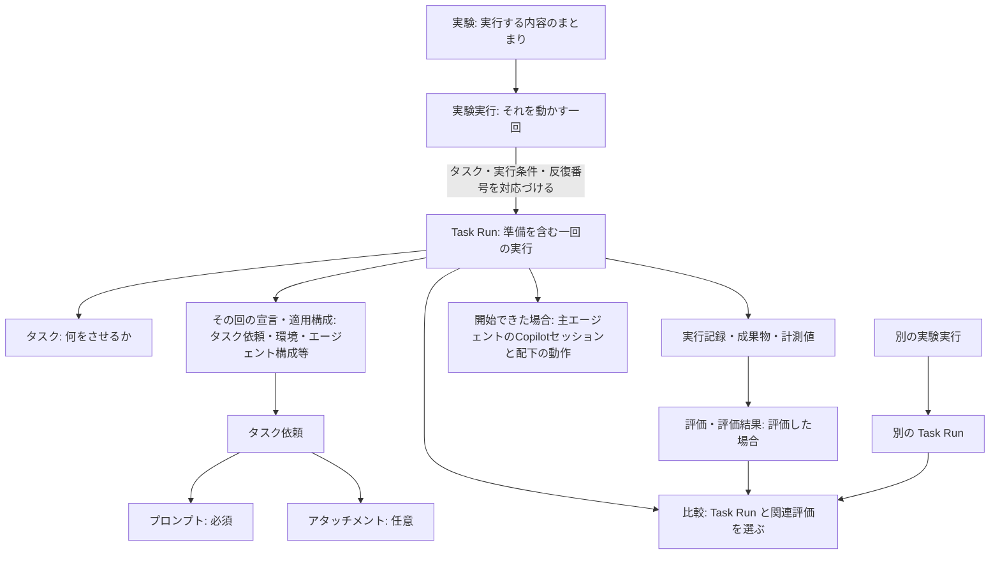

# ドメインモデル

草案。製品で区別する概念とその関係をまとめる。用語の定義はここに置き、各 spec から参照する。

対象は、利用者が Copilot にタスクを異なる条件で実行させ、記録と評価から違いを判断する領域である。製品の価値は [プロダクト方針](product-vision.md)、機能要求・提供段階は [機能仕様の索引](../specs/README.md) から参照する。ここでは概念の意味、関係、識別、守るべきルールを定める。

保存と比較の中心はタスク実行（Task Run）とする。実験（Experiment）は実行する内容をまとめ、実験実行（Experiment Run）は環境準備や並列化などを管理してそれを動かす一回である。どちらも比較の境界ではない。

## 実験・タスクと実行

### 定義表

| 用語 | 英語名 | 意味 | 例 |
| --- | --- | --- | --- |
| 実験 | Experiment | タスク、実行条件、反復、評価基準・評価セット、並列上限等の実行方針、必要に応じた準備手順・評価器をまとめた、実行を手配するための再利用可能なまとまり | レビュー対象、2モデルの実行条件、各3回の反復、採点基準をまとめた実験 |
| 実験実行 | Experiment Run | 選択した実験に従い、環境準備・並列化等をまとめて管理して Task Run を実行する一回のまとまり。一条件だけでも成立し、比較対象を限定しない | レビューはモデルA・B、解説文はB・Cで各3回、全体の並列上限2件で実行する |
| タスク | Task | 評価対象のエージェントに達成してほしい具体的な仕事。タスク依頼や評価基準そのものとは区別する | あるプロジェクトのコードをレビューする |
| タスク実行 | Task Run | 準備を含め、タスクを一回実行しようとする単位。主エージェントを開始した場合は最初の Copilot セッションに対応する。タスク・環境・エージェント構成・配下の動作・成果・使用量と関連評価をたどれる、保存と比較の基本単位 | レビューを一回実行する。準備で失敗した場合も条件と理由を保存する |
| タスク依頼 | Task Request | タスクをエージェントへ伝える、必須のプロンプトと任意のアタッチメントの組み合わせ | 「この資料を初心者向けに解説して」というプロンプトと資料ファイル |
| プロンプト | Prompt | タスク依頼でエージェントへ送るユーザーの依頼文 | 「問題を指摘して」、着眼点まで詳しく伝える文章 |
| アタッチメント | Attachment | タスク依頼に任意で添えるコンテキスト。プロンプトとは別に渡すファイル等 | 解説の元資料として添えるファイル |
| 実行条件 | Execution Condition | タスクに適用するタスク依頼・環境・エージェント構成等の指定の組み合わせ | 同じ環境とモデルに、改良前または改良後の primitives を適用する指定 |
| 構成単位 | Configuration Unit | 実行条件のうち、Task Run ごとに内容・値・版等を対応づけて追跡するまとまり | モデル、OS、環境一式、primitives 一式 |
| 反復 | Repetition | 同じタスク・実行条件を複数回試すこと。各回を反復番号で区別し、再試行は元と同じ反復に対応づける | 同じレビューを3回試す |
| 再試行 | Retry | 実行エラーに対し、同じ反復に新しい Task Run を対応づけて最初からやり直すこと | 明示的に再試行対象に指定した通信エラー後にやり直す |
| 再開 | Resume | 元の実験実行の条件を保ち、完了分を残して未完了分を続けること | 途中停止した比較の残りを実行する |
| 追加反復 | Additional Repetitions | 同じタスク・実行条件を試す回数を増やし、新しい反復番号の実行予定を追加すること | 3回の測定に7回を追加する |
| 遠隔実行 | Remote Execution | 手元以外の実行先で処理を動かすこと | 別のマシンへ実行を依頼する |
| 分散実行 | Distributed Execution | 一つの実験実行に含まれるタスクの実行を複数の実行先で分担すること | 6回の実行予定を2台へ割り当てる |

### 関係

| 概念の関係 | 意味 |
| --- | --- |
| 実験 → 実験実行 | 同じ実験を複数回実行でき、各実行にその時点の適用構成と記録が対応する |
| 実験・タスク・実行条件 | 一つの実験で複数タスクを扱い、タスクごとに異なる実行条件群を指定できる。同じ実行条件群の一括指定は作成の便宜であり、実行管理のまとまりの制約ではない |
| 実行条件・構成単位・Task Run | 実行条件で指定した内容と、その回に適用した内容を構成単位ごとに対応づける。比較では、選んだ Task Run 間で構成単位の値や版を照合する |
| タスク・タスク依頼・エージェント構成 | 仕事、その伝え方、Copilot の動かし方は別。プロンプトやアタッチメントの変更と、スキル等によるカスタマイズを区別する |
| タスク依頼・プロンプト・アタッチメント | 一つのタスク依頼はプロンプトを必須とし、アタッチメントは省略または複数指定できる |
| アタッチメント・環境 | 環境にファイルを配置することと、タスク依頼にそのファイルを添えることは別。同じファイルが両方に関係してよい |
| タスク・分類 | 利用者が付けた分類で複数タスクの結果を整理する。分類自体は実行する上位タスクではない |
| タスク・評価基準 | 各タスクに必要な基準を指定する。同じ基準を各タスクに記述してよく、共通基準専用の管理は前提にしない |
| 実験実行 → Task Run | 選択したタスク・実行条件ごとの反復番号に Task Run を対応づける。未着手の予定には Task Run がなく、準備開始後は初回実行と必要に応じた再試行が対応する |
| Task Run → 再試行元の Task Run | 再試行は別の Task Run として保存し、再試行元と関連づける。実験実行・タスク・実行条件・反復番号は同じものを使う |
| Task Run → タスク・適用構成 | その一回の仕事と、タスク依頼・環境・エージェント構成等の宣言・適用情報を対応づける。元の定義の現在の内容だけに依存しない |
| Task Run → 実行環境 | 指定された開始状態を用意してからエージェントを動かす。準備失敗で実行環境が完成しなかった場合も、その状態を Task Run に記録する |
| Task Run → 実行記録・評価 | 個々の実行からその条件・記録・成果・使用量へたどれる。評価した場合は評価結果も対応づける |

### 概念図

実験から実行対象を手配する関係と、Task Run ごとに条件・記録をたどる関係を示す。比較は実験実行の境界をまたいで Task Run と関連評価を選ぶ。

再試行する場合は、別の Task Run を作って再試行元と関連づける。例えば1タスク・2条件・各3反復のうち1回を再試行すると、予定した反復は計6回のまま、Task Run は7件になる。

### ルール

#### タスクと条件

- 実験ファイルやコードは Experiment の表現方法であり、別のドメイン概念にはしない。調べたい問いや目的は実験の説明として扱い、独立した管理単位を前提にしない。
- タスクの同一性は、利用者が同じ仕事として明示した対応づけに基づく。本体が名前・入力・タスク依頼・評価基準の一致や類似だけで統合しない。依頼の詳しさや採点観点の追加では同じ仕事、問題の指摘から修正への目的変更では別の仕事と捉える。
- Gitの解説とコンテナの解説のように、題材の異なる具体的な仕事は別タスクとし、共通の分類でまとめる。
- 同じプロジェクトのコードレビューは、対象コードの版が変わっても同じタスクとして継続追跡する。版の違いは入力・環境の違いとして識別し、対象コードが異なる実行を同条件の反復とは扱わない。
- 一つのタスクは複数手順を含めてよい。「レビューして修正する」全体を一つの仕事として試せる。手順やサブエージェントの数だけでタスクを分割しない。
- 本製品で評価するのは、一度のタスク依頼を受け、その後は利用者や評価基盤から追加の指示・確認への返答を与えずに、Copilot が自律的に進める仕事である。
- タスク依頼・構成・環境は、一項目だけでもまとめてでも変えられる。プロンプトだけを比較するために primitives へ書き換える必要はない。リポジトリ構造の比較では、同じ仕事・評価基準でベース環境を変える。
- 実行条件は候補の全組み合わせでも、選んだ組み合わせだけでもよい。プロンプトとモデルを同時に変えた2条件だけでは、どちらの効果かを切り分けられない。
- 実行条件の名前から動作を推測しない。比較で変えない設定も、結果を解釈するための適用構成に含める。
- 構成単位は、実際に値が異なる場合だけ存在するものではない。追跡する粒度は対象に応じて定める。primitives は一式を単位とし、個々のスキル単位の追跡は前提にしない。一式として追跡することと、内部の内容を記録・確認することは別である。
- 「入力資料」はタスク遂行のために読ませる情報の役割を表す説明語であり、独立した管理単位ではない。配置する資料は環境に、プロンプトへ含める資料やアタッチメントで渡す資料はタスク依頼に含めて扱う。
- 入力資料の配置やアタッチメントの指定は、モデルが読み取った証拠ではない。評価セットの内容は、明示的に公開するものを除きエージェントへの入力と分ける。
- 独立した Case・Evaluation Dataset の管理は必須にせず、反復の予定を識別するためにも要求しない。事例はタスクや環境で表し、不足した場合に独立した概念を検討する。

設定の共有・タスク依頼の指定位置・アタッチメントの渡し方は [全体設計](architecture.md#実験の記述と準備手順評価器の拡張をどう扱うか) で扱う。

#### 実行の識別と制御

- 実験実行を再度開始すれば、同じ構成でも別の実行となる。条件名やモデル名だけで同一性を決めない。
- 定義やスキルを後から変更しても、過去の実行に対応する適用内容を書き換えない。
- 各 Task Run に前回の変更を持ち越さない。準備済み環境の再利用と、変更済み環境の継承を区別する。
- 実験実行内でタスク・実行条件・反復番号ごとの予定枠を管理し、未着手分を失わない。予定枠は実行管理上の説明であり、独立した主要用語にはしない。
- 再試行は別の Task Run として記録するが、元と同じ反復に対応づけ、独立した反復に数えない。
- 条件を変更した実行は、元の実験実行の再開として混在させない。再開は Copilot セッションの途中状態の復元や完了済みの反復の追加実行を意味しない。
- 各反復のトークン・AIC 上限は、その反復に対応する失敗した Task Run を含む累積使用量へ適用する。再試行で消費済み使用量をリセットしない。
- 自動再試行はデフォルトで無効とし、実行エラーの理由と観測事実を記録する。利用者が対象エラーと回数上限を明示した場合だけ有効にする。低い評価、明示的な停止、使用量上限到達を理由に、自動的に成功するまで繰り返さない。
- SDK 内部のリトライは、本体が管理する Task Run とは別に扱う。本体の自動再試行を無効にすることは、SDK 内部のリトライも無効にする意味ではない。内部処理が観測できない場合も、観測できた使用量を勝手に除外しない。
- 本体は条件の偏りを抑える実行順序を組み、予定と実際の順序を記録する。具体的な順序の決め方と並列実行時の扱いは設計で定め、完全な公平性は保証しない。
- 実験実行の寿命と依頼元 CLI の寿命は別である。遠隔実行での接続断は、処理完了・失敗・取消しの証拠とはならない。
- 正常終了・基盤障害・上限到達・手動停止という終了理由と、待機・準備・実行・評価・後片付けという進行段階を区別する。

Task Run は従来の Attempt に代わる位置づけであり、追加の階層ではない。準備失敗で主エージェントのセッションが作られなかった場合も、Task Run に準備失敗の理由とセッション未作成を記録する。準備失敗をモデルの品質の不合格として扱わない。

状態遷移・停止完了の条件は [全体設計](architecture.md#誰が実行を持ち続けるか)、個別制御の機能要件は [実行管理 spec](../specs/002-execution-management/spec.md) で扱う。

## エージェント構成と外部概念

### 定義表

| 用語 | 英語名 | 意味 | 例 |
| --- | --- | --- | --- |
| primitives | Primitives | 通常の Copilot カスタマイズの要素。プロンプトとアタッチメントからなるタスク依頼とは区別する | カスタムインストラクション、スキル、カスタムエージェントの定義、Copilot hooks、MCP 設定 |
| SDK 設定 | SDK Configuration | エージェント実行を操作するために SDK へ渡す設定 | モデル、reasoning effort、ツール公開範囲、接続設定 |
| エージェント構成 | Agent Configuration | 適用する primitives と SDK 設定等の組み合わせ | レビュー用スキルとモデル設定 |
| Copilot SDK | GitHub Copilot SDK | Copilot のランタイムをプログラムから操作する外部ライブラリ | セッションへタスクを送るライブラリ |
| CLI ランタイム | CLI Runtime | Copilot セッションを管理し、モデル呼び出しとツール実行の処理を進める外部エンジン | 特定バージョンの Copilot CLI |
| モデル | Model / LLM | 入力コンテキストに基づき、応答やツールへの要求を生成する言語モデル | コードを読み、次に調べるファイルや最終的な回答を判断するモデル |
| effort | Reasoning Effort | 対応モデルの推論にかける処理量を調整する設定 | low と high |
| BYOK | Bring Your Own Key | 利用者が用意したモデル接続先と認証を用いる接続方法 | 自分のモデル API を使用する |
| MCP | Model Context Protocol | 外部ツールやデータとの接続に用いるプロトコル | ドキュメント検索サービスへの接続 |
| ツール | Tool | エージェントが要求し、ランタイムを通じて実行する処理 | ファイルの読み取り、検索、コマンド実行 |
| エージェント | Agent | 指示と文脈に基づき、モデルを用いて判断し、必要なツールを使いながら仕事を進める主体 | コードを調べて問題を指摘する Copilot |
| カスタムエージェント | Custom Agent | 役割・指示・利用可能なツール・モデル等を指定する、名前を持つ再利用可能なエージェント定義 | レビュー用の指示と読み取り専用ツールを指定した定義 |
| スキル | Skill | 特定の仕事に使う知識や手順を、`SKILL.md` を入口としてまとめた再利用可能なカスタマイズ | レビューの観点と調査手順をまとめたスキル |
| 主エージェント | Primary Agent | タスクの依頼を受けて処理を進める評価対象のエージェント | レビューを受け持つ Copilot |
| サブエージェント | Subagent | 主エージェントから処理を委譲されるエージェント | 特定領域の調査を受け持つエージェント |
| Copilot セッション（SDK セッション） | Copilot Session / SDK Session | Copilot ランタイムが識別・管理する継続的な単位。利用者の依頼、エージェントの応答、ツール要求・結果等の履歴と関連状態を扱う | 一度のレビュー依頼から、調査のためのツール実行と最終回答までを扱うセッション |
| モデル入力コンテキスト | Model Input Context | あるモデル呼び出しで渡す、指示・依頼・関連する履歴やツール結果等の情報 | レビューの指示、読み取ったコード、直前の調査結果 |
| コンテキストウィンドウ | Context Window | モデルが一度に扱える情報量の枠 | モデルごとに定められたトークン量の上限 |
| compaction | Compaction | セッションを継続するため、モデルに渡す文脈を圧縮・再構成する処理 | 長い調査の経緯を要約して処理を続ける |

### 関係

- Copilot hooks は評価対象の primitives。評価基盤や Spec Kit の工程前後に動く hooks とは別である。
- SDK セッションは、SDK を通じて操作する Copilot セッションを指す。SDK の利用によって別のセッション概念が加わるわけではない。
- 一つの依頼から、複数回のモデル呼び出しやツール実行が起こる。モデルがツール実行を要求すると、ランタイムが実行を進め、結果を後続のモデル呼び出しへ渡す。
- Copilot セッション自体は複数の依頼を扱える。本製品で扱う仕事の範囲は、[タスクと条件のルール](#タスクと条件)で定める。
- 同じカスタムエージェントの定義を、セッション開始時に主担当として選択する場合と、主エージェントの委譲先として利用可能にする場合の両方を比較対象にする。定義の内容と、主担当・委譲先という役割を区別する。
- Task Run は作成された最初の主エージェントの Copilot セッションに対応づけ、その配下のサブエージェントの動作も追跡する。準備失敗等でセッションが作られない Task Run もある。Copilot セッションそのものや、モデル API の一回の呼び出しとは区別する。

### ルール

- 主・サブエージェントの構成は宣言に従う。実行条件の名前からモデルを自動変更しない。
- セッションは、その時点のモデル入力コンテキストそのものではない。compaction によって文脈が変わってもセッションの同一性は変わらず、新しい Task Run や反復にもならない。
- primitives の利用可能性と実際の利用を区別する。スキルや委譲先のカスタムエージェントを置く効果の比較には、利用可能でも発動・委譲されなかった結果を含める。
- スキルの発動という観測事実と、手順への準拠や仕事への効果という評価を区別する。「利用」の意味を一律に固定せず、記録や判定では何を観測・評価したかを明示する。
- 配置・適用の失敗、未利用、利用有無の観測不能を混同しない。
- 製品開発を支援するエージェントは、評価対象のエージェントとは区別する。

外部概念の根拠は Copilot SDK の公式資料を参照する：[実行ループ](https://github.com/github/copilot-sdk/blob/main/docs/features/agent-loop.md)、[セッションと compaction](https://github.com/github/copilot-sdk/blob/main/nodejs/README.md#infinite-sessions)、[セッションとモデル入力の分離](https://github.com/github/copilot-sdk/blob/main/docs/features/context-management.md)、[カスタムエージェント](https://github.com/github/copilot-sdk/blob/main/docs/features/custom-agents.md)、[スキル](https://github.com/github/copilot-sdk/blob/main/docs/features/skills.md)。

## 環境と実行先

### 定義表

| 用語 | 英語名 | 意味 | 例 |
| --- | --- | --- | --- |
| 環境 | Environment | エージェントがタスクを行う場となる、OS・ツール・ファイル・サービス・アクセス条件などと、その状態のまとまり | コードとビルドツール、検証用 API があり、外部への通信が制限された作業の場 |
| 環境定義 | Environment Definition | 用意したい環境の状態と、その準備手順・条件の記述 | OS、ツール、資料、サービス、通信制限の指定 |
| 実行環境 | Execution Environment | 環境定義から実際に用意された状態 | 開発ツールと資料を配置し、サービスを起動した作業環境 |
| 配置物 | Environment Asset | 環境に配置するファイル等。利用目的はそれぞれ別に持つ | 入力資料、スキル、検証プログラム |
| 取得元 | Source | 配置物をどこから取得するかの指定 | ローカルフォルダー、リポジトリとコミット |
| 準備手順 | Setup Procedure | エージェントの開始前に、配置・導入・初期化等によって必要な環境の状態を用意する処理。利用者が実装するスクリプト等も含む | ファイル配置、依存関係の導入、テストデータの初期化 |
| サービス | Service | タスク実行中に利用する継続動作する処理 | ローカル API、検証用サーバー |
| 実行先 | Execution Target | 処理を動かすコンピューティングリソース、またはその指定 | 手元の PC、既存リモートマシン、Azure VM |
| 外部情報参照ポリシー | External Information Access Policy | タスク遂行中に利用してよい外部情報源の指定 | Microsoft Learn の参照だけを認める |
| モック | Mock | 実サービスの代わりに、呼び出しに対して定義された応答を返す仕組み | リソース一覧を返す外部コマンドの固定応答 |
| 準備済み環境 | Prepared Environment | 準備の一部を省力化するため再利用する状態 | ツールを導入済みのイメージ |

### 関係

| 概念の関係 | 意味 |
| --- | --- |
| 環境・環境定義・実行環境 | 作業の場、その記述、実際に用意した状態を区別する。「ベース環境」は開始前の土台を指す説明語で、別の管理単位ではない |
| エージェント構成・環境・実行先 | Copilot をどう動かすか、どのような場で作業させるか、どの計算資源で動かすかを区別する |
| 配置物・取得元・情報の役割 | 同じ場所に配置されても、入力資料・primitives・評価セットの役割と公開範囲は異なる |
| 外部情報参照ポリシー・モック | 利用を認める情報源と、呼び出しに返す内容を区別する。宛先の許可だけでは内容を固定できない |
| MCP 設定・接続先の振る舞い | Copilot に渡す接続・利用設定はエージェント構成に、接続先が返すデータ・応答・エラー条件等は環境に位置づける。接続設定を変えず、モックの応答定義だけを変えることもできる |
| 準備手順・エージェントの行動 | 本体が開始前に環境を用意する処理と、タスク遂行中にエージェント自身が選んで行う処理を区別する |

### ルール

- 環境には実行先との適合条件がある。Windows 用の環境を任意の OS で使えるとはしない。Git は取得元の一例、VM・コンテナは環境の実現方式の候補である。
- 配置場所や取得元だけで情報の公開可否を決めない。
- 環境準備時の取得、モデル接続、タスク遂行中の外部情報取得を区別する。準備時の取得にタスク遂行中の参照制限をそのまま当てはめない。
- ツールの非公開化、通信先の制限、取得内容の固定は別の制御とする。内容の固定にはローカル資料やモックを用いる。
- モックは各モデルに同じ応答定義を適用するが、呼び出し順序は強制しない。評価対象のモデル自体は実際に動かし、未定義呼び出しには指定された応答方針を適用する。
- 意図したモックのエラーはタスクの想定状況として扱い、基盤障害という理由で再試行しない。代替手段の選択や報告などの対処を評価する。
- モックの振る舞いは、OS・配置物等を含む環境一式の違いとして追跡する。モックだけの独立した構成単位や、外部システムという別の管理単位は現時点では必須にしない。

## 記録・評価・比較

### 定義表

| 用語 | 英語名 | 意味 | 例 |
| --- | --- | --- | --- |
| 実行記録 | Execution Record | 適用構成、観測した行動・応答・状態・時刻・使用量等を追跡する記録 | ツール呼び出しとその応答 |
| 成果物 | Artifact | タスク実行によって作成・変更されたファイル等 | レポート、修正コード、画像 |
| 計測値 | Metric | 観測に基づく使用量・時間・回数等の値 | 入力トークン数、処理時間 |
| 評価基準 | Evaluation Criterion | 入力の何をどの基準で判定するかの定義。処理を実行するコンポーネントの名称ではない | 指摘が既知の問題と一致するか |
| 評価セット | Evaluation Set | 既知の問題や期待結果など、採点時に参照するデータの集合。本製品では、評価対象の課題集や評価器・評価基準の一式を意味しない | レビュー対象に含まれる既知のバグの一覧 |
| 評価器 | Evaluator | 必要な入力を定め、評価基準を適用して評価結果を返す処理の実装。標準提供または利用者による実装を用いる | 既知の問題一覧との照合関数、検証コマンドを実行する処理、rubric を適用する LLM 採点処理 |
| 評価 | Evaluation | 実行記録・成果物・計測値・実行環境等の入力へ、指定された評価基準を適用する処理 | コマンド検証と内容判定を行う |
| 評価結果 | Assessment | 評価基準を適用して得た判定と、その理由・指摘等の情報 | 合否、rubric の点数、理由、指摘 |
| 評価軸 | Evaluation Axis | 複数の Task Run の値を集約・比較する項目。標準メトリックと、評価で得た数値・合否を扱う | 入力トークン数、同じ rubric による正確性の点数、検証の合否 |
| 集約方法 | Aggregation Method | 同じ評価軸の複数の値を、統計値や内訳にまとめる方法 | 点数の平均・中央値、合格率、合否の件数 |
| 比較 | Comparison | 対象の Task Run を選び、共通する評価軸の値を、選んだ構成単位によるグループごとに集約して違いを見る行為 | 昨日と今日の実行結果を選び、primitives 一式の版ごとに品質と使用量を見比べる |
| 比較結果 | Comparison Result | 選択した Task Run、評価軸、グループ分けに用いた構成単位、集約方法に対応づけた、集約値・件数と元の記録への参照 | primitives の版ごとの正確性の平均、合格率、有効件数・対象件数、ばらつき |
| 再評価 | Re-evaluation | 同じ Task Run の保存済み成果物・記録等を用いて、評価処理だけを適用し直すこと。タスク実行そのものはやり直さない | 生成済み文章を変更した rubric や別の採点モデルで判定する |
| テストケース | Test Case | 検証プログラムが扱う個別の入力と期待結果等 | 単価100円・数量2で200円を期待する |
| テストセット | Test Suite | 複数のテストケースをまとめたもの | 注文計算の通常系と異常系のテスト |
| トークン数 | Token Count | モデルが処理する入力や生成する出力の量をトークン単位で表す値 | 入力8,000、出力2,000トークン |
| AIC | AI Credits | Copilot の課金単位 | Task Run で消費した AI Credits |
| 金額 | Monetary Cost | 料金体系に基づく費用。実測情報と換算・推定を区別する | 接続先の料金表から計算したドル額 |

### 関係

| 概念の関係 | 意味 |
| --- | --- |
| 実行記録・成果物・計測値・実行環境 → 評価 → 評価結果 | 指定基準を利用可能な入力へ適用して判定する。LLM による採点だけでなく、ファイル確認やコマンド検証も含む |
| 評価基準・評価器・評価 | 何を判定するかを評価基準で定め、それを適用する実装を評価器と呼ぶ。評価は指定された入力に評価器を実行することである |
| 評価器・必要な入力 | 評価器ごとに、成果物・実行記録・計測値・実行時の状態・検証用の環境など、必要な入力と前提を定める。保存済みコードを検証するために用意する環境と、元の Task Run の実行時状態は区別する |
| 評価セット・評価器 | 評価器が判定に必要な参照データとして評価セットを用いる。参照データが不要な評価にまで必須とはしない |
| 計測値・評価結果・評価軸 | 記録されたメトリックや判定値を、評価軸の値として使う。判定理由や指摘の文章は、元の評価結果を理解するための情報として区別する |
| 構成単位・評価軸 | 構成単位は何の違いでグループ分けするか、評価軸は何の値を集約して比べるかを表す。実行時の指定のまとまりと、比較時に選ぶグループ分けは同一ではない |
| 評価軸・集約方法 | 各評価軸には、利用可能な集約方法のリストと既定の方法がある。その評価軸を提供する実装側で定義する |
| テストケース・テストセット → 評価 | 判定に使う入力や検証プログラムの単位であり、実験実行の基本単位ではない |
| 選んだ Task Run の記録・評価結果 → 比較 → 比較結果 | 比較は実験ファイルをまたげる。全体の傾向、種類別・題材別の得手不得手、過去と今回の差を元の記録に対応づける |
| 上限管理・使用量の評価 | 実行を止める制御と、消費量を基準に照らして判定する処理は別である |

### 比較の流れ

1. 対象の Task Run を選ぶ。実験・実験実行への所属は選択の手掛かりであり、比較の境界にはしない。
2. 選択した Task Run 全体で共通する評価軸を求める。標準メトリックに加え、同じ採点基準・評価器とその設定による評価の軸を対象とする。値の欠測と、軸が共通しないことは区別する。
3. 構成単位の値や版を照合し、全件で同じものをグループ分けの候補から除く。
4. 値が異なる構成単位から一つ以上を選び、その値の組み合わせごとに Task Run をグループ化する。
5. グループごとに、共通する評価軸の値を、選択した集約方法または既定の方法で集約する。

値が異なる構成単位が一つもない場合は、構成単位の選択を求めず、全件を一つのグループとして集約する。

### ルール

- 各 Task Run から、タスク・タスク依頼・入力資料・環境・エージェント構成・実行制御の宣言と、その実行に対応する適用情報を網羅的にたどれるようにする。実験の現在の内容や条件名だけに依存して過去の実行を解釈しない。環境の完全保存は前提にせず、メタデータ・識別子・ハッシュ等による記述や参照と、実体を保持していることを区別する。
- 利用者が持ち込んだタスク依頼・スキル・設定は、Task Run で使った当時の内容を後から読めるように保持する。タスク依頼はプロンプトだけでなく指定したアタッチメントも含む。内容の保存または保持された不変の版への参照で実現し、元ファイルのパスやハッシュだけで済ませない。秘密情報は保存対象から分け、秘匿・省略した範囲を識別する。OS・外部サービスの全状態の保存を意味しない。
- 評価する入力、基準と設定、判定を一回の評価に対応づける。基準や処理を変更した結果で、過去の判定を上書きしない。
- 同じ入力・採点基準・評価器とその設定による正常な評価結果が既にある場合は、その結果を再利用する。ここで正常とは評価処理が完了して判定が得られたことであり、判定が合格であることではない。保存済み結果を参照・再利用するために、元の実行時状態の復元を求めない。
- 実行時の状態が必要な評価は、その状態を失う前に実施し、結果を保存する。すべての実行環境を保存・復元可能にすることは要求しない。
- 必要な入力が利用可能なら、Task Run の終了後に初めて評価したり、基準や採点設定を変更して再評価したりしてよい。保存済み成果物と検証用の環境で行える評価を、元の実行時状態の復元が必要な評価と混同しない。
- 新たな評価に必要な入力が残っていない、または用意できない場合は、不足している入力を示して実施不可とする。状態を推測して採点したり、その評価のために Task Run を自動的に再実行したりしない。
- 実行の終了状態と評価の判定は別軸とする。正常終了したタスクでも不合格になり得る。途中終了した場合は、その原因と利用可能な入力に応じて評価対象を判断する。
- 作業の成果ではなく確認の質問を返した場合も、その応答を評価対象にする。適切な確認か、不要な足踏みかは評価基準で判断し、質問したことだけで基盤障害や不合格とは扱わない。
- Copilot ランタイムからモデル API への通信失敗でエラー終了し、実験側で再試行して成果を得た場合、再試行前の履歴を品質評価へ混ぜない。その履歴は診断ログとして参照可能にし、通常の比較 UI に並べる評価結果とはしない。累積使用量の上限管理は、品質評価の対象選択とは別に行う。
- 基盤が正常な環境でエージェントが誤ったコマンドを選び、エラーに対処できなかった場合は、その行動と成果を品質評価の対象にする。操作ミスを基盤障害として自動再試行しない。
- 基盤障害が回復せず、その反復で成果を得られなかった場合は、品質の不合格や0点にしない。通常の結果でも評価対象件数と実行できなかった件数を区別し、障害の詳細や再試行履歴は診断ログで扱う。
- 未評価、評価処理の失敗・入力不足による判定不能、判定した結果の不合格を区別する。得られた判定と得られなかった項目を分け、失敗をゼロ点に変換しない。
- タスク全体の成功判定が必要なら、評価基準の一つとして指定する。本体は項目別の結果から暗黙の総合判定を作らない。例えば「問題の特定は合格、修正は不合格」という結果だけでも成立する。
- 宣言した構成、観測した適用、取得不能な情報を区別する。省略・打ち切り・秘匿を、情報が存在しなかったこととして扱わない。
- タスクを実行するための使用量と、評価処理の使用量を区別する。後からの評価で Task Run の再実行を省いても、追加の採点や検証環境には別途費用が生じ得る。トークン、AIC、金額の相互変換には、取得元・単位・料金根拠が必要である。
- 基盤障害後に再試行した場合、品質と並べる使用量・料金は成果を得た Task Run の値とする。障害で終了した Task Run を含む実際の総消費量・料金は別に確認できるようにし、比較用の値と混同しない。
- 評価軸の名前や尺度が同じだけでは、共通の評価軸とみなさない。実際に用いた採点基準・評価器とその設定を対応づけ、rubric の定義や採点に使うモデルが異なる評価を同じ軸へ混ぜない。評価対象のモデルと採点モデルは別に記録する。
- 共通の評価軸は、一部の Task Run が未評価・評価失敗・判定不能でも比較から外さない。グループごとに得られた値だけを集約し、評価軸ごとの有効件数と、グループに属する対象 Task Run の件数を示す。有効な値が一件もない場合は未算出とする。
- 標準メトリックが共通の評価軸であることは、全件で値を取得できることを意味しない。メトリックの欠測も有効件数と対象件数で区別する。
- 同じ実行条件で得た複数の Task Run に同じ評価を正常に適用できた場合、それぞれを別のサンプルとして計上する。
- 数値と合否のどちらも評価軸として扱う。集約は、その軸に定義された方法で行い、本体が判定理由の文章等を暗黙に点数へ変換しない。
- 採点の粒度は評価基準で定める。バグの発見状況は網羅性の rubric 等で扱い、本体にバグごとの専用評価モデルを設けることは前提にしない。
- 基準となる構成は必須にせず、必要な比較でだけ指定する。全体の傾向を見る場合も、単一の総合点を前提にしない。
- 実行条件が異なるだけで比較を禁止しない。グループ内には、選ばなかった構成単位の違いが残ることもある。記録された差を示し、解釈は利用者に委ねる。スキルとランタイム版の両方が変わった差を、スキルだけの効果と断定しない。
- 比較の閲覧は新たなタスク実行や評価を発生させない。
- 成果物は人間の確認と改善のために保持する。全ディスクの保存や実行後環境の完全復元を前提にしない。

結果形式・比較の保存は [全体設計](architecture.md#実験の記述と準備手順評価器の拡張をどう扱うか)、評価をやり直す操作と提供範囲は [ローカル比較 spec の Scope](../specs/001-local-comparison/spec.md#scope-and-adjacent-features) で扱う。

## 再利用の区別

### 定義表

| 用語 | 英語名 | 意味 | 例 |
| --- | --- | --- | --- |
| プロンプトキャッシュ | Prompt Cache | モデル提供側による共通入力の処理の再利用 | 同じ指示のキャッシュ読込 |
| 実行結果キャッシュ | Execution Result Cache | 保存済み結果を返して新たなエージェント実行を省略する仕組み | 過去の回答と計測値を返す |

### 関係

準備済み環境は環境準備、プロンプトキャッシュはモデル側の入力処理、実行結果キャッシュはタスク実行の結果を再利用する。それぞれ再利用する対象が異なる。

正常に完了した評価結果の再利用は、評価処理の再実施を省くことであり、エージェント実行を省く実行結果キャッシュとは区別する。

### ルール

- プロンプトキャッシュが使われても、新たなタスク実行を省略したとはみなさない。
- 使用量・料金の比較はプロンプトキャッシュの効果を含む実消費を基本とする。どの状況でどれだけキャッシュが使われたかを分析できるよう、観測できた利用量を対象の実行条件・記録に対応づける。観測不能を利用ゼロにせず、キャッシュなしの換算値を示す場合は実消費と区別する。
- Copilot セッションが異なることだけで、提供側のプロンプトキャッシュが分離されたとはみなさない。接続先ごとの共有範囲と観測可能性は技術検証で確認する。
- 準備済み環境を使う場合も、[各 Task Run の開始状態のルール](#実行の識別と制御)に従う。

## 責務と設計上の境界

### 定義表

| 担当 | 境界 |
| --- | --- |
| 利用者 | copilot-eval を使って実験を行う人。実験を用意し、公開する入力・利用権限・評価基準を指定して結果を判断する。職種としての開発者を意味しない |
| copilot-eval | 宣言を適用し、環境の準備、実行管理、記録、評価、集計を担う |
| Copilot SDK / CLI ランタイム | 評価対象のエージェントのセッション管理・モデル接続・ツール実行を担う |
| 実行先プロバイダー | 実行先固有の投入・制限・状態確認・停止・回収・資源管理を扱う担当部分の仮称。API やプラグイン化は未決 |

### 関係

利用者の定義を copilot-eval が適用し、エージェントの動作は SDK・ランタイムへ、実行先固有の管理は実行先プロバイダーへつなぐ。

### ルール

- 責務の区分だけで、別サービス・別パッケージへの分割を決めない。
- サービスの維持は無条件の再起動を意味しない。SDK と本体が管理するプロセスの分担は設計で決める。

このモデルからだけでは決まらない配置・保存・通信制御・拡張契約は [全体アーキテクチャ](architecture.md) で扱う。環境構築支援や CI などの利用機能は [各 spec](../specs/README.md) に置き、ここで再定義しない。
